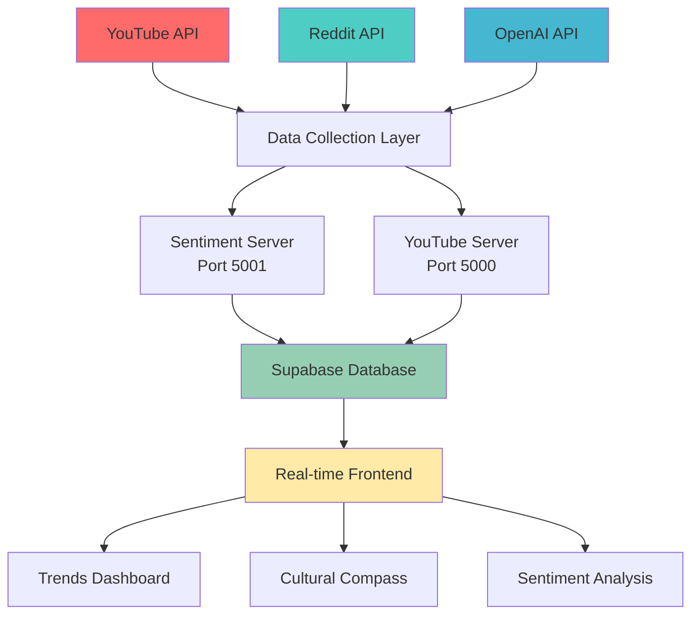

# 🌊 WaveSight - Social Intelligence & Trend Tracking Platform

<div align="center">


**Transform how you understand and predict digital trends with AI-powered social intelligence**

[](https://python.org)
[](https://javascript.com)
[](https://supabase.com)
[](LICENSE)

[🚀 Quick Start](#quick-start) • [📖 Features](#features) • [🔧 Setup](#setup) • [📊 Demo](#demo) • [📝 Docs](#documentation)

</div>

---

## 🎯 What is WaveSight?

WaveSight is an advanced social intelligence platform that combines real-time data collection from multiple platforms with AI-powered analytics to provide unprecedented insights into emerging digital trends, viral content, and cultural movements.

### ✨ Key Features

- 🌊 **WaveScope Timeline** - Advanced viral trend detection with proprietary WaveScore algorithm (0-100 scale)
- 📊 **Reddit Sentiment Dashboard** - Real-time community sentiment analysis with topic tiles and heatmaps
- 🧭 **Cultural Compass** - Interactive multi-dimensional cultural trend mapping with 6 positioning axes
- 🧩 **Trend Tiles System** - Cross-platform normalized analytics with Z-score standardization
- ⚠️ **Intelligent Alerts** - Advanced alert system with severity levels and watchlist functionality
- 📈 **Real-Time Analytics** - 30-second refresh intervals with viral detection algorithms
- 🎯 **Multi-Platform Intelligence** - Unified scoring across YouTube, Reddit, TikTok data sources

---

## 🚀 Quick Start (5 Minutes)

### 1. Clone & Setup
```bash
git clone https://github.com/yourusername/wavesight.git
cd wavesight
python3 setup.py
```

### 2. Configure APIs (2 minutes)
- **Supabase**: Database & real-time updates → [Guide](DOCS/API-SETUP-GUIDE.md#1-supabase-setup-5-minutes---required)
- **YouTube API**: Trending video data → [Guide](DOCS/API-SETUP-GUIDE.md#2-youtube-api-setup-3-minutes---required)
- **Reddit API**: Sentiment analysis → [Guide](DOCS/API-SETUP-GUIDE.md#3-reddit-api-setup-2-minutes---required)

### 3. Start Services
```bash
# Terminal 1: Backend
python3 SERVER/sentiment_server.py

# Terminal 2: Frontend  
python3 -m http.server 8080
```

### 4. Open WaveSight
Visit [http://localhost:8080](http://localhost:8080) 🎉

---

## 📊 Demo

### Live Dashboards

| Dashboard | Purpose | Key Features |
|-----------|---------|-------------|
| **🌊 WaveScope Timeline** | Advanced viral trend detection | WaveScore algorithm, Trend Tiles, 10-category tracking |
| **📊 Reddit Sentiment** | Real-time community analysis | Topic tiles, sentiment heatmaps, comment drill-down |
| **🧭 Cultural Compass** | Multi-dimensional trend mapping | 6 cultural axes, interactive positioning, momentum tracking |
| **⚠️ Alerts Intelligence** | Custom trend notifications | Severity levels, watchlist, viral detection alerts |

### Example Analysis

```bash
# Test sentiment analysis
curl -X POST http://localhost:5001/api/analyze-sentiment \
  -H "Content-Type: application/json" \
  -d '{"topic": "artificial intelligence"}'

# Response
{
  "success": true,
  "data": {
    "topic": "artificial intelligence",
    "confidence": 72.5,
    "sentiment_yes": 58,
    "sentiment_no": 22,
    "prediction_outcome": "Likely",
    "cultural_momentum": "Rising"
  }
}
```

---

## 🏗️ Architecture



### Tech Stack

**Frontend**
- Vanilla JavaScript with Canvas API for custom visualizations
- HTML5/CSS3 with responsive design
- Supabase client for real-time subscriptions

**Backend**
- **Python/Flask** - Sentiment analysis & cultural trends
- **Node.js/Express** - YouTube data collection
- **Supabase** - PostgreSQL database with real-time features

**APIs & AI**
- YouTube Data API v3 for trending videos
- Reddit API (PRAW) for sentiment data
- OpenAI GPT for enhanced sentiment analysis
- VADER sentiment analyzer for baseline analysis

---

## 🔧 Setup

### Prerequisites
- Python 3.8+
- Node.js 14+ (optional)
- Git

### Installation

#### Option 1: Automated Setup (Recommended)
```bash
python3 setup.py
```

#### Option 2: Manual Setup
```bash
# 1. Install Python dependencies
pip install flask flask-cors praw openai supabase vaderSentiment requests python-dotenv

# 2. Configure environment
cp .env.example .env
# Edit .env with your API keys

# 3. Set up database
# Run CONFIG/supabase_schema.sql in your Supabase project

# 4. Start services
python3 SERVER/sentiment_server.py
python3 -m http.server 8080
```

### API Keys Required

| Service | Purpose | Free Tier | Setup Time |
|---------|---------|-----------|------------|
| **Supabase** | Database & real-time | 500MB + 2GB bandwidth | 3 min |
| **YouTube API** | Trending videos | 10K quota/day | 2 min |
| **Reddit API** | Sentiment data | 60 req/min | 1 min |
| **OpenAI** | Enhanced analysis | $5 credit | 2 min (optional) |

**Total Setup Time**: ~8 minutes

---

## 📊 Features Deep Dive

### 🌊 WaveScope Timeline - Advanced Viral Detection
- **Proprietary WaveScore Algorithm**: 0-100 scale with 4 weighted components
  - 🔹 **Reach (40%)**: Views, upvotes, shares, engagement volume
  - 🔹 **Velocity (30%)**: Rate of growth vs. previous periods
  - 🔹 **Sentiment (20%)**: Public emotional tone & engagement quality
  - 🔹 **Momentum (10%)**: Sudden spikes & virality triggers
- **Trend Tiles System**: Cross-platform normalized analytics with Z-score standardization
- **10-Category Tracking**: Viral, AI, Entertainment, Music, Gaming, Sports, News, Crypto, Education, Health
- **Interactive Timeline**: Canvas-based visualization with time periods (1M, 3M, 6M, 1Y, 5Y, MAX)

### 📊 Reddit Sentiment Dashboard - Community Intelligence
- **Top-Level Metrics**: Trending subreddits, negative topic surge detection, high-engagement threads
- **Time-Series Analysis**: Multi-topic sentiment tracking with confidence bands and comparison tools
- **Live Topic Tiles**: Reddit posts with sentiment meters, engagement stats, momentum badges
- **Subreddit Heatmap**: Cross-community sentiment correlation visualization (8 subreddits × 5 topics)
- **Comment Drill-Down**: Top comments analysis with emotion tags (🧠 Thoughtful, 💥 Controversial, 😂 Funny)
- **Alerts & Watchlist**: Keyword monitoring with volume and sentiment shift notifications

### 🧭 Cultural Compass - Multi-Dimensional Mapping
- **6 Cultural Dimensions**: Configurable axis pairs for comprehensive trend positioning
  - Mainstream ↔ Underground × Traditional ↔ Disruptive
  - Mass Appeal ↔ Subcultural Depth × High Energy ↔ Chill/Laid Back
  - Early Adopter ↔ Late Majority × Sentimental ↔ Ironic/Detached
- **Interactive Positioning**: Clickable trend points with detailed cultural metrics and tooltips
- **Advanced Scoring**: Community engagement pattern analysis and cultural momentum tracking
- **15 Trend Categories**: Technology, Entertainment, Fashion, Lifestyle, Politics, Environment, Culture

### ⚠️ Intelligent Alerts - Proactive Monitoring
- **Severity Levels**: Critical, High, Medium, Low with visual indicators and trend classification
- **Multi-Criteria Detection**: Volume thresholds, sentiment shifts, growth rate spikes, viral momentum
- **Alert Management**: Dismissal system with alert history tracking and filtering capabilities
- **Real-Time Monitoring**: 30-second refresh intervals with automated trend scanning

---

## 🔬 API Reference

### WaveScope Timeline API
```bash
GET /api/youtube-data           # Fetch trending YouTube data
GET /api/fetch-youtube          # Search specific content with filters
POST /api/process-trends        # Trigger cultural analysis processing
GET /api/health                 # API health and configuration status
```

### Reddit Sentiment API  
```bash
GET /api/reddit-sentiment       # Fetch Reddit sentiment data
POST /api/analyze-topic         # Analyze specific topic sentiment
GET /api/subreddit-stats        # Get subreddit statistics and trends
```

### Cultural Compass API
```bash
GET /api/cultural-trends        # Fetch cultural trend positioning data
POST /api/cultural-analysis     # Run cultural positioning analysis
GET /api/trend-dimensions       # Get multi-dimensional scoring
```

### Alerts System API
```bash
GET /api/alerts                 # Fetch alert data with filtering
POST /api/run-alert-scan        # Trigger alert generation scan
POST /api/alerts/:id/dismiss    # Dismiss specific alert by ID
```

---

## 🔒 Security & Privacy

- **Environment Variables**: All API keys stored securely
- **Row Level Security**: Database access controls
- **Rate Limiting**: Built-in API quota management
- **No Personal Data**: Only public trend data collected
- **CORS Protection**: Configured for secure origins

---

## 🚀 Deployment

### Local Development
```bash
python3 -m http.server 8080
```

### GitHub Pages (Static)
1. Push to GitHub
2. Enable GitHub Pages
3. Configure environment variables in frontend

### Heroku/Railway (Full Stack)
1. Configure buildpacks for Python + Node.js
2. Set environment variables
3. Deploy with database migrations

### Docker
```bash
docker build -t wavesight .
docker run -p 8080:8080 wavesight
```

---

## 📈 Usage Examples

### Content Creator Use Case
```python
# Find trending topics for content planning
trends = get_trending_by_category("Technology")
sentiment = analyze_sentiment("AI tools")
wave_score = calculate_viral_potential("ChatGPT alternatives")

if wave_score > 0.7 and sentiment["confidence"] > 70:
    print("🔥 High potential topic found!")
```

### Marketing Team Use Case
```python
# Track brand sentiment and cultural positioning
brand_sentiment = analyze_sentiment("your-brand-name")
cultural_position = map_cultural_compass(["your-brand", "competitors"])
alerts = setup_alerts(["brand mentions", "competitor trends"])
```

### Researcher Use Case
```python
# Study digital culture evolution
cultural_trends = analyze_cultural_movement(["remote work", "digital nomads"])
temporal_analysis = track_sentiment_over_time("sustainability")
cross_platform_correlation = compare_platforms(["youtube", "reddit"])
```

---

## 🤝 Contributing

We welcome contributions! See our [Contributing Guide](DOCS/CONTRIBUTING.md).

### Development Setup
```bash
git clone https://github.com/yourusername/wavesight.git
cd wavesight
python3 setup.py
python3 verify_setup.py
```

### Running Tests
```bash
python3 test_apis.py          # Test API connections
python3 verify_setup.py       # Verify installation
```

---

## 📝 Documentation

- 📖 [Setup Guide](DOCS/SETUP-GUIDE.md) - Complete installation instructions
- 🔑 [API Setup](DOCS/API-SETUP-GUIDE.md) - Get your API keys in 15 minutes
- 🏗️ [Architecture](DOCS/ARCHITECTURE.md) - Technical deep dive
- 🤝 [Contributing](DOCS/CONTRIBUTING.md) - Development guidelines
- 🐛 [Troubleshooting](DOCS/TROUBLESHOOTING.md) - Common issues & solutions

---

## 🎯 Roadmap

- [ ] **Multi-Platform Expansion**: TikTok, Twitter, Instagram APIs
- [ ] **Machine Learning Models**: Custom trend prediction models
- [ ] **Real-Time Alerts**: Email/SMS notifications
- [ ] **API Rate Optimization**: Intelligent quota management
- [ ] **Mobile App**: React Native companion app
- [ ] **Enterprise Features**: Team collaboration, advanced analytics

---

## 📄 License

This project is licensed under the MIT License - see the [LICENSE](LICENSE) file for details.

---

## 🙏 Acknowledgments

- **Supabase** for the amazing real-time database platform
- **VADER Sentiment** for robust sentiment analysis
- **Reddit API (PRAW)** for social data access
- **YouTube Data API** for trending video insights
- **OpenAI** for enhanced natural language processing

---

<div align="center">

**Built with ❤️ for the digital trend analysis community**

[⭐ Star this repo](https://github.com/yourusername/wavesight) • [🐛 Report Bug](https://github.com/yourusername/wavesight/issues) • [💡 Request Feature](https://github.com/yourusername/wavesight/issues)

</div>